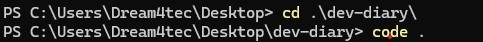

# dev-diary

# Hello my name *is* **SARA**

### I am 21 years old i studied information security and networking , i also studied programming languages .

## I always seek to improve myself and learn new things.

##  I learned from *Good Developer Mindset* that developers with a growth mindset are more resilient in the face of challenges and more they view failures and challenges as opportunities to learn and improve

## I learned from the *Terminal Command Cheat sheet* some basic terminals commands like
+ cd
+ pwd
+ rm
+ ls

